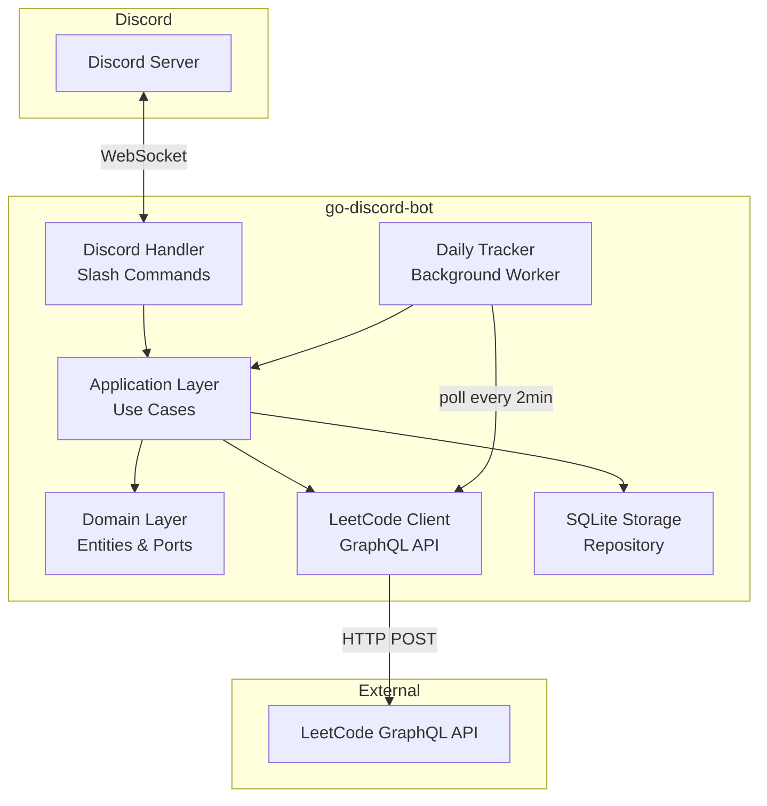

# Go Discord Bot — LeetCode Daily Challenge Tracker

Bot Discord viết bằng Go, tự động thông báo khi user đã giải xong daily question LeetCode, hỗ trợ đăng ký user và xem stats.

## Background & Context

- **LeetCode không có public API chính thức** — sử dụng internal GraphQL endpoint `https://leetcode.com/graphql` (unofficial, có thể thay đổi).
- **Discord Bot Library**: [`discordgo`](https://github.com/bwmarrin/discordgo) — thư viện Go phổ biến nhất cho Discord API.
- **Storage**: SQLite (pure Go driver `modernc.org/sqlite` — không cần CGO, dễ deploy).
- **Architecture**: Hexagonal / Clean Architecture — tương tự style project `go-judge-system` mà bạn đã làm.

---

## User Review Required

> [!IMPORTANT]
> **Lựa chọn Database**: Plan sử dụng SQLite cho đơn giản (single binary, không cần ops). Nếu bạn muốn dùng PostgreSQL hoặc database khác, cho mình biết.

> [!IMPORTANT]
> **Polling Interval**: Bot sẽ poll LeetCode API mỗi **2 phút** để check xem user đã solve daily chưa. Interval này có phù hợp không?

> [!WARNING]
> **LeetCode API Risks**: API này là unofficial, có thể bị rate-limit hoặc thay đổi bất cứ lúc nào. Bot sẽ implement retry + exponential backoff để giảm thiểu rủi ro.

> [!IMPORTANT]
> **Notification Channel**: Bot sẽ gửi thông báo vào channel nào? Có 2 lựa chọn:
> 1. **Slash command `/setchannel`** — admin dùng lệnh để set channel nhận thông báo
> 2. **Config cứng qua environment variable** — đơn giản hơn
>
> Plan hiện tại chọn **option 1** (linh hoạt hơn). Bạn muốn thay đổi không?

---

## Tính năng chính

| # | Feature | Slash Command | Mô tả |
|---|---------|---------------|--------|
| 1 | Đăng ký user | `/register <leetcode_username>` | Đăng ký LeetCode username để bot theo dõi |
| 2 | Hủy đăng ký | `/unregister` | Xóa đăng ký khỏi bot |
| 3 | Xem stats | `/stats [username]` | Xem thống kê LeetCode (solved count, rating, v.v.) |
| 4 | Set channel | `/setchannel` | Admin set channel nhận thông báo daily |
| 5 | Auto-notify | *(background)* | Tự động thông báo khi user solve daily question |
| 6 | Xem daily | `/daily` | Xem thông tin daily question hôm nay |

---

## Kiến trúc tổng quan



---

## Project Structure

```
go-discord-bot/
├── cmd/
│   └── bot/
│       └── main.go                    # Entry point, wire dependencies
├── internal/
│   ├── domain/
│   │   ├── entity/
│   │   │   ├── user.go                # User entity (discord_id, leetcode_username, guild_id)
│   │   │   ├── daily_question.go      # Daily question entity
│   │   │   └── submission.go          # Submission/tracking record
│   │   └── port/
│   │       ├── inbound/
│   │       │   └── usecase.go         # Use case interfaces (RegisterUser, GetStats, etc.)
│   │       └── outbound/
│   │           ├── user_repository.go # User CRUD
│   │           ├── config_repository.go # Guild config (notification channel)
│   │           └── leetcode_client.go # LeetCode API interface
│   ├── application/
│   │   ├── register_user.go           # RegisterUser use case
│   │   ├── unregister_user.go         # UnregisterUser use case
│   │   ├── get_stats.go              # GetStats use case
│   │   ├── get_daily.go              # GetDaily use case
│   │   └── set_channel.go           # SetChannel use case
│   └── adapter/
│       ├── inbound/
│       │   └── discord/
│       │       ├── bot.go             # Discord session setup, command registration
│       │       ├── handler.go         # Interaction handler (router)
│       │       └── commands.go        # Command definitions
│       └── outbound/
│           ├── leetcode/
│           │   ├── client.go          # HTTP client for LeetCode GraphQL
│           │   ├── queries.go         # GraphQL query strings
│           │   └── types.go           # Response types
│           └── sqlite/
│               ├── db.go              # DB connection, migrations
│               ├── user_repository.go # User repository implementation
│               └── config_repository.go # Config repository implementation
├── pkg/
│   └── tracker/
│       └── tracker.go                 # Background daily tracking worker
├── .env.example                       # Environment variable template
├── go.mod
├── go.sum
├── Makefile
└── README.md
```

---

## Proposed Changes (Chi tiết)

### Domain Layer

#### [NEW] [user.go](file:///home/tien/project/go/go-discord-bot/internal/domain/entity/user.go)
```go
type User struct {
    ID                int64
    DiscordID         string  // Discord user ID
    GuildID           string  // Discord guild/server ID
    LeetCodeUsername  string
    CreatedAt         time.Time
}
```

#### [NEW] [daily_question.go](file:///home/tien/project/go/go-discord-bot/internal/domain/entity/daily_question.go)
```go
type DailyQuestion struct {
    Date       string   // "2026-04-22"
    Title      string
    TitleSlug  string
    Difficulty string   // Easy, Medium, Hard
    Link       string
    TopicTags  []string
}
```

#### [NEW] [submission.go](file:///home/tien/project/go/go-discord-bot/internal/domain/entity/submission.go)
```go
// Track daily completions — tránh thông báo trùng lặp
type DailyCompletion struct {
    ID               int64
    UserID           int64
    Date             string   // "2026-04-22"
    QuestionSlug     string
    CompletedAt      time.Time
}
```

---

#### [NEW] [usecase.go](file:///home/tien/project/go/go-discord-bot/internal/domain/port/inbound/usecase.go)
Inbound port interfaces:
- `RegisterUser(ctx, discordID, guildID, leetcodeUsername) error`
- `UnregisterUser(ctx, discordID, guildID) error`
- `GetUserStats(ctx, leetcodeUsername) (*UserStats, error)`
- `GetDailyQuestion(ctx) (*DailyQuestion, error)`
- `SetNotificationChannel(ctx, guildID, channelID) error`

#### [NEW] [user_repository.go](file:///home/tien/project/go/go-discord-bot/internal/domain/port/outbound/user_repository.go)
```go
type UserRepository interface {
    Create(ctx, user *User) error
    Delete(ctx, discordID, guildID string) error
    GetByDiscordID(ctx, discordID, guildID string) (*User, error)
    GetByGuildID(ctx, guildID string) ([]*User, error)
    GetAll(ctx) ([]*User, error)
}
```

#### [NEW] [leetcode_client.go](file:///home/tien/project/go/go-discord-bot/internal/domain/port/outbound/leetcode_client.go)
```go
type LeetCodeClient interface {
    GetDailyQuestion(ctx) (*DailyQuestion, error)
    GetUserProfile(ctx, username string) (*UserStats, error)
    GetRecentAcceptedSubmissions(ctx, username string, limit int) ([]Submission, error)
}
```

---

### Outbound Adapters

#### [NEW] LeetCode GraphQL Client — `internal/adapter/outbound/leetcode/`

3 GraphQL queries chính:

**1. Daily Question:**
```graphql
query questionOfToday {
  activeDailyCodingChallengeQuestion {
    date
    link
    question {
      frontendQuestionId: questionFrontendId
      difficulty
      title
      titleSlug
      topicTags { name }
    }
  }
}
```

**2. User Stats:**
```graphql
query getUserProfile($username: String!) {
  matchedUser(username: $username) {
    username
    profile {
      realName
      ranking
    }
    submitStatsGlobal {
      acSubmissionNum {
        difficulty
        count
      }
    }
  }
}
```

**3. Recent Accepted Submissions** (dùng để check daily completion):
```graphql
query recentAcSubmissions($username: String!, $limit: Int!) {
  recentAcSubmissionList(username: $username, limit: $limit) {
    title
    titleSlug
    timestamp
  }
}
```

- HTTP client dùng `net/http` standard library
- Implement retry + exponential backoff
- Rate limiting: max 1 request/second

---

#### [NEW] SQLite Storage — `internal/adapter/outbound/sqlite/`

**Schema:**
```sql
CREATE TABLE IF NOT EXISTS users (
    id INTEGER PRIMARY KEY AUTOINCREMENT,
    discord_id TEXT NOT NULL,
    guild_id TEXT NOT NULL,
    leetcode_username TEXT NOT NULL,
    created_at DATETIME DEFAULT CURRENT_TIMESTAMP,
    UNIQUE(discord_id, guild_id)
);

CREATE TABLE IF NOT EXISTS guild_configs (
    id INTEGER PRIMARY KEY AUTOINCREMENT,
    guild_id TEXT NOT NULL UNIQUE,
    notification_channel_id TEXT NOT NULL
);

CREATE TABLE IF NOT EXISTS daily_completions (
    id INTEGER PRIMARY KEY AUTOINCREMENT,
    user_id INTEGER NOT NULL,
    date TEXT NOT NULL,
    question_slug TEXT NOT NULL,
    completed_at DATETIME DEFAULT CURRENT_TIMESTAMP,
    UNIQUE(user_id, date),
    FOREIGN KEY (user_id) REFERENCES users(id) ON DELETE CASCADE
);
```

- Dùng `modernc.org/sqlite` (pure Go, no CGO)
- Auto-migration on startup
- WAL mode cho concurrent reads

---

### Inbound Adapter — Discord Bot

#### [NEW] `internal/adapter/inbound/discord/bot.go`
- Init `discordgo.Session`
- Register slash commands via `ApplicationCommandBulkOverwrite`
- Add interaction handler
- Graceful shutdown

#### [NEW] `internal/adapter/inbound/discord/commands.go`
Định nghĩa slash commands:
```go
var commands = []*discordgo.ApplicationCommand{
    {
        Name:        "register",
        Description: "Đăng ký LeetCode username để bot theo dõi",
        Options: []*discordgo.ApplicationCommandOption{
            {
                Type:        discordgo.ApplicationCommandOptionString,
                Name:        "username",
                Description: "LeetCode username của bạn",
                Required:    true,
            },
        },
    },
    {
        Name:        "unregister",
        Description: "Hủy đăng ký khỏi bot",
    },
    {
        Name:        "stats",
        Description: "Xem thống kê LeetCode",
        Options: []*discordgo.ApplicationCommandOption{
            {
                Type:        discordgo.ApplicationCommandOptionString,
                Name:        "username",
                Description: "LeetCode username (bỏ trống = xem stats của mình)",
                Required:    false,
            },
        },
    },
    {
        Name:        "daily",
        Description: "Xem daily question hôm nay",
    },
    {
        Name:        "setchannel",
        Description: "Set channel nhận thông báo daily (Admin only)",
    },
}
```

#### [NEW] `internal/adapter/inbound/discord/handler.go`
- Route interactions to appropriate use case
- Format responses as Discord Embeds (rich messages với màu sắc theo difficulty)
- Error handling & ephemeral responses

---

### Background Worker — Daily Tracker

#### [NEW] `pkg/tracker/tracker.go`

Logic chính:
```
every 2 minutes:
  1. Fetch daily question from LeetCode
  2. For each registered user in each guild:
     a. Check if already notified today (daily_completions table)
     b. If not, fetch recentAcSubmissionList(username, 20)
     c. If daily question's titleSlug found in submissions:
        - Insert into daily_completions
        - Send notification to guild's notification channel
```

- Dùng `time.Ticker` cho scheduling
- Context-aware cancellation
- Concurrent user checking với goroutines + semaphore (limit 5 concurrent)

---

### Entry Point

#### [NEW] `cmd/bot/main.go`
- Load config từ environment variables
- Init SQLite DB
- Wire all dependencies (manual DI)
- Start Discord bot
- Start background tracker
- Graceful shutdown (SIGINT/SIGTERM)

---

### Config & Environment

#### [NEW] `.env.example`
```env
DISCORD_BOT_TOKEN=your_bot_token_here
DISCORD_APP_ID=your_app_id_here
DATABASE_PATH=./data/bot.db
POLL_INTERVAL=2m
LOG_LEVEL=info
```

---

## Dependencies

| Package | Purpose |
|---------|---------|
| `github.com/bwmarrin/discordgo` | Discord API client |
| `modernc.org/sqlite` | SQLite driver (pure Go, no CGO) |
| `github.com/joho/godotenv` | Load .env files |
| `log/slog` | Structured logging (stdlib) |

---

## Notification Message Format

Bot sẽ gửi Discord Embed đẹp khi user solve daily:

```
🎉 Daily Challenge Completed!
━━━━━━━━━━━━━━━━━━━━━━
👤 @username đã giải xong daily question!

📝 Two Sum (#1)
🟢 Easy
🔗 https://leetcode.com/problems/two-sum/

⏰ Completed at: 17:30 UTC+7
━━━━━━━━━━━━━━━━━━━━━━
```

Màu embed theo difficulty: 🟢 Easy = Green, 🟡 Medium = Yellow, 🔴 Hard = Red

---

## Open Questions

> [!IMPORTANT]
> 1. **Bạn đã tạo Discord Bot Application chưa?** Cần Bot Token và Application ID từ [Discord Developer Portal](https://discord.com/developers/applications).
> 2. **Bot sẽ chạy ở bao nhiêu server?** Nếu chỉ 1 server thì có thể đơn giản hóa một số logic (guild-scoped commands, không cần multi-guild support).
> 3. **Có muốn thêm leaderboard/ranking giữa các user trong server không?** (Feature mở rộng tiềm năng)

---

## Verification Plan

### Automated Tests
- Unit test cho LeetCode GraphQL client (mock HTTP responses)
- Unit test cho SQLite repositories
- Unit test cho use cases
- Integration test: register → poll → detect → notify flow

### Manual Verification
- Chạy bot locally với test Discord server
- Register một LeetCode username thật
- Giải daily question và verify bot gửi notification
- Test `/stats` command với các username khác nhau
- Test error cases (invalid username, duplicate registration, v.v.)
